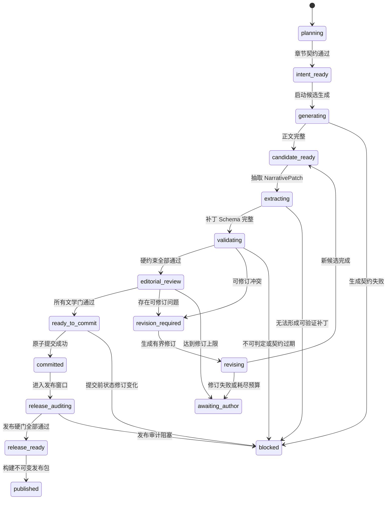

# 自动化小说 V2：章节生命周期状态机

## 1. 文档目的

本文定义一章小说从规划、生成、验证、修订、提交到发布的完整状态机，避免把“正文已生成”“事务已提交”和“可以发布”混为一个 `completed` 状态。

配套文档：

- [叙事内核领域模型](./narrative-kernel-domain-model.md)
- [叙事事件数据库模型](./narrative-event-store-schema.md)

## 2. 三类状态必须分离

### 2.1 工作流运行状态

表示系统当前正在做什么：生成、抽取、验证、修订、等待用户或恢复。

### 2.2 章节权威状态

表示是否存在已提交正文，以及它是否仍与当前上游事实一致。

```ts
type ChapterAuthorityStatus =
  | 'uncommitted'
  | 'committed'
  | 'downstream_stale'
  | 'superseded'
```

### 2.3 发布状态

表示某个精确章节版本是否进入某个不可变发布包。

```ts
type ChapterReleaseStatus =
  | 'not_audited'
  | 'blocked'
  | 'release_ready'
  | 'published'
```

这三类状态不得压缩到同一列，也不能由 UI 自行推断。

## 3. 主状态机



## 4. 状态定义

| 状态 | 进入条件 | 允许动作 | 禁止动作 |
|---|---|---|---|
| `planning` | 上一章已提交或作品初始化完成 | 生成章节意图 | 生成正文 |
| `intent_ready` | 意图通过本地契约检查 | 启动生成 | 修改权威状态 |
| `generating` | 已锁定意图和状态修订 | 记录模型结果 | 切换模型协议 |
| `candidate_ready` | 正文非空、未截断、字数合规 | 抽取补丁 | 标记完成 |
| `extracting` | 候选哈希固定 | 生成结构化补丁 | 改写正文 |
| `validating` | 补丁 Schema 和证据完整 | 执行确定性规则 | 调用模型决定硬规则 |
| `editorial_review` | 所有硬约束通过 | 质量和情绪验收 | 延后门后继续提交 |
| `revision_required` | 问题可在同一意图内修订 | 建立修订任务 | 无限重试 |
| `revising` | 修订预算未耗尽 | 生成子候选 | 原地覆盖父候选 |
| `awaiting_author` | 自动化无法收敛 | 人工裁决或修改契约 | 自动恢复运行 |
| `ready_to_commit` | 所有门均明确通过 | 原子提交 | 再修改候选 |
| `committed` | 章节事务成功 | 生成下章、进入窗口审计 | 原地修改正文 |
| `release_auditing` | 窗口版本集合固定 | 执行发布规则 | 更换窗口章节版本 |
| `release_ready` | 无阻塞、无 deferred、无过期证据 | 构建发布包 | 静默改正文 |
| `published` | 发布包哈希落库 | 创建新发布版本 | 修改既有发布包 |
| `blocked` | 发生不可自动处理错误 | 人工修复根因后重开步骤 | 自动跳过 |

## 5. 转移契约

### 5.1 `planning -> intent_ready`

必须满足：

- `baseStateRevision` 等于当前小说头修订；
- 引用的实体全部存在；
- 必须事件和禁止事件不冲突；
- 情绪合同有明确起点、触发、选择、代价和余波；
- 目标字数范围合法；
- 上一章承诺和本章目标之间存在推进关系。

### 5.2 `generating -> candidate_ready`

必须满足：

- 模型调用正常结束；
- `finishReason` 不是长度截断；
- 正文非空；
- 正文字数处于契约范围；
- 输出不是分析、JSON 外壳或错误信息；
- 候选正文和输入契约均已计算哈希。

失败时保持同一模型契约进行有界重试。禁止切换模型、降低要求或接受不完整正文。

### 5.3 `extracting -> validating`

必须满足：

- `NarrativePatch` 通过版本化 Schema；
- 每个实体引用都是 ID；
- 每个变更事件都有精确证据；
- 证据哈希与当前候选正文一致；
- 补丁声明的 `baseStateRevision` 未变化。

### 5.4 `validating -> editorial_review`

验证器固定按以下顺序执行：

1. 版本与证据完整性；
2. 实体引用唯一性；
3. 事件前置条件；
4. 人物位置与生死；
5. 道具来源、所有权、数量和状态；
6. 世界事实和人物认知；
7. 时间线；
8. 章节必须/禁止事件；
9. 读者承诺操作；
10. Reducer 试运行和结果哈希。

任何一项失败，后续文学评分不执行。

### 5.5 `editorial_review -> ready_to_commit`

必须存在明确结果的门：

| Gate | 允许结果 |
|---|---|
| 因果与人物动机 | `passed` / `failed` |
| 情绪合同 | `passed` / `failed` |
| 章节目标兑现 | `passed` / `failed` |
| 文风与人物声音 | `passed` / `failed` |
| 模板化与重复 | `passed` / `failed` |
| 开篇承诺与结尾钩子 | `passed` / `failed` |

`pending`、`deferred`、`unknown` 都不是通过。

### 5.6 `ready_to_commit -> committed`

单一 SQLite 事务中执行：

1. 再次比较当前权威修订和 `baseStateRevision`；
2. 插入不可变 `chapter_version`；
3. 追加 `narrative_events`；
4. 插入 `evidence_spans`；
5. 写入新 `state_revision`；
6. 写入 `chapter_commit`；
7. 写入 outbox 事件；
8. 提交事务。

任何唯一约束、外键、状态哈希或规则失败都回滚整个事务。

## 6. 修订状态机

每个问题必须声明修订边界：

```ts
type RepairScope =
  | 'expression_only'
  | 'paragraph'
  | 'scene'
  | 'whole_chapter'
  | 'chapter_intent'
  | 'story_bible'
```

只有前四类允许在当前章节自动修订。后两类会进入 `awaiting_author`，因为它们改变创作方向或上游权威契约。

修订预算按失败族计算，而不是共用一个无限计数器：

```text
generation_contract: 2
patch_extraction: 2
hard_invariant: 3
editorial_quality: 3
emotion_contract: 2
```

同一失败码连续出现两次时，第三次不得重复相同修订策略。预算耗尽后进入 `awaiting_author`。

## 7. 取消、崩溃与恢复

### 7.1 用户取消

- 当前运行写入 `desired_state = cancelled`；
- 正在进行的模型流停止；
- 已完成候选和评审保留为不可变产物；
- 未发生章节提交时不得改变权威状态；
- 取消不能被解释为失败或完成。

### 7.2 进程崩溃

- 只有持有有效租约的 worker 可以执行步骤；
- 步骤以 `inputHash + protocolVersion + attemptNo` 唯一标识；
- 恢复时只重跑没有成功输出产物的步骤；
- 如果模型请求结果未知，使用同一 `requestId` 查询本地调用记录，不直接发起第二次请求；
- 已提交事务依赖数据库原子性，不执行补偿式猜测。

### 7.3 状态修订过期

候选生成后，只要上游章节或故事圣经发生权威变化：

- 当前候选标记 `stale`；
- 所有评审和证据失效；
- 重新创建章节意图；
- 不允许把旧补丁绑定到新修订。

## 8. 人工编辑流程

### 8.1 未提交候选

人工编辑创建新的子候选，不覆盖原候选。之后从 `extracting` 重新开始。

### 8.2 已提交章节


措辞修改若不改变任何事件，仍需重新执行证据和文学验收。事实修改必须使受影响的下游章节进入 `downstream_stale`。

## 9. 发布窗口状态机

发布窗口不是动态查询，而是固定版本集合：

```ts
interface ReleaseWindowCandidate {
  workId: string
  chapterVersionIds: string[]
  authorityRevision: number
  policyVersion: number
  evidenceProtocolVersion: number
}
```

窗口发生任一变化即创建新候选，旧审计不能复用。

发布审计必须检查：

- 所有章节均为已提交且非 stale；
- 章节版本连续；
- 无未完成重放任务；
- 无 unresolved 或 deferred 门；
- 所有发现绑定精确正文位置；
- 跨章实体、时间、知识和读者承诺投影一致；
- 综合文学评分达到策略阈值。

## 10. 工作流稳定失败码

| 类别 | 示例 | 默认结果 |
|---|---|---|
| `MODEL_CONTRACT` | `EMPTY_BODY`、`OUTPUT_TRUNCATED` | 有界重试后阻塞 |
| `SCHEMA` | `PATCH_SCHEMA_INVALID` | 有界重新抽取后阻塞 |
| `DOMAIN` | `ARTIFACT_NOT_OWNED` | 修订正文或人工裁决 |
| `STALE` | `STATE_REVISION_STALE` | 重新规划，不重试旧输入 |
| `EDITORIAL` | `EMOTION_PAYOFF_MISSING` | 有界修订 |
| `RELEASE` | `RELEASE_GATE_INCOMPLETE` | 阻止发布 |
| `INFRASTRUCTURE` | `DB_BUSY`、`PROCESS_INTERRUPTED` | 恢复同一步骤 |

错误分类必须依据稳定代码，不依据可变错误文案或子类名称。

## 11. 状态机验收测试

1. `deferred` 质量门不能进入 `ready_to_commit`。
2. 候选基于旧修订时不能提交。
3. 同一步骤恢复十次只产生一个成功产物。
4. 取消后不存在半提交章节。
5. 人工编辑已提交章节后，下游版本自动标记 stale。
6. 发布窗口中任一章节正文变化后，旧审计立即失效。
7. 同一失败族耗尽预算后进入 `awaiting_author`，不会无限循环。
8. 应用重启后恢复到准确步骤，而不是重新开始整轮目标循环。
