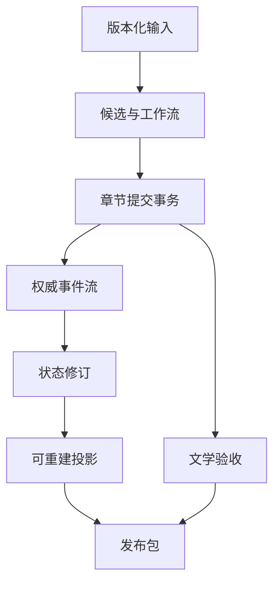

# 自动化小说 V2：叙事事件数据库模型

## 1. 文档目的

本文定义 SQLite 中的权威写模型、不可变产物、查询投影和发布数据。它是逻辑 Schema，不是对现有表的增量兼容方案。

实施时创建独立 V2 数据库或全新表集，完成一次性迁移后切换。旧运行表只读归档，不双写、不参与恢复、不作为 fallback。

配套文档：

- [叙事内核领域模型](./narrative-kernel-domain-model.md)
- [章节生命周期状态机](./chapter-lifecycle-state-machine.md)

## 2. 存储原则

1. 权威历史只追加，不原地覆盖。
2. 所有 JSON 都有 `schema_version`，并在写入前经过本地 Schema 验证。
3. 正文、故事圣经、意图、候选、评审和发布包都以内容哈希绑定。
4. 一个章节提交只产生一个新的小说状态修订。
5. UI 查询使用投影表，投影可以删除并重建。
6. 模型调用日志不是权威事实。
7. 发布包一旦创建不可修改。
8. 所有时间使用 UTC ISO-8601；所有业务 ID 使用应用生成的 UUID/ULID。

## 3. 表分组



## 4. 作品与故事圣经

### 4.1 `novel_streams`

```sql
CREATE TABLE novel_streams (
  work_id              INTEGER PRIMARY KEY,
  head_revision        INTEGER NOT NULL DEFAULT 0,
  story_bible_version_id TEXT,
  last_chapter_ordinal INTEGER NOT NULL DEFAULT 0,
  state_hash           TEXT NOT NULL,
  created_at           TEXT NOT NULL,
  updated_at           TEXT NOT NULL,
  FOREIGN KEY (work_id) REFERENCES works(id) ON DELETE CASCADE
);
```

`novel_streams` 是并发控制头，不保存完整领域状态。

### 4.2 `story_bible_versions`

```sql
CREATE TABLE story_bible_versions (
  id                   TEXT PRIMARY KEY,
  work_id              INTEGER NOT NULL,
  parent_version_id    TEXT,
  schema_version       INTEGER NOT NULL,
  content_json         TEXT NOT NULL,
  content_hash         TEXT NOT NULL,
  source_kind          TEXT NOT NULL CHECK (source_kind IN ('author', 'planning_candidate')),
  created_at           TEXT NOT NULL,
  UNIQUE (work_id, content_hash),
  FOREIGN KEY (work_id) REFERENCES works(id) ON DELETE CASCADE,
  FOREIGN KEY (parent_version_id) REFERENCES story_bible_versions(id)
);
```

## 5. 实体注册表

### 5.1 `narrative_entities`

```sql
CREATE TABLE narrative_entities (
  id                     TEXT PRIMARY KEY,
  work_id                INTEGER NOT NULL,
  kind                   TEXT NOT NULL,
  canonical_name         TEXT NOT NULL,
  introduced_event_id    TEXT,
  retired_event_id       TEXT,
  created_at             TEXT NOT NULL,
  UNIQUE (work_id, kind, canonical_name, id),
  FOREIGN KEY (work_id) REFERENCES works(id) ON DELETE CASCADE
);
```

### 5.2 `narrative_entity_aliases`

```sql
CREATE TABLE narrative_entity_aliases (
  entity_id              TEXT NOT NULL,
  normalized_alias       TEXT NOT NULL,
  valid_from_revision    INTEGER NOT NULL,
  valid_to_revision      INTEGER,
  PRIMARY KEY (entity_id, normalized_alias, valid_from_revision),
  FOREIGN KEY (entity_id) REFERENCES narrative_entities(id) ON DELETE CASCADE
);

CREATE INDEX idx_entity_alias_lookup
  ON narrative_entity_aliases(normalized_alias, valid_from_revision, valid_to_revision);
```

别名查询命中多个有效实体时由领域服务阻塞，不在数据库层任意选择第一项。

## 6. 章节意图与候选

### 6.1 `chapter_intents`

```sql
CREATE TABLE chapter_intents (
  id                     TEXT PRIMARY KEY,
  work_id                INTEGER NOT NULL,
  chapter_ordinal        INTEGER NOT NULL,
  base_state_revision    INTEGER NOT NULL,
  story_bible_version_id TEXT NOT NULL,
  schema_version         INTEGER NOT NULL,
  contract_json          TEXT NOT NULL,
  contract_hash          TEXT NOT NULL,
  status                 TEXT NOT NULL CHECK (status IN ('active', 'stale', 'superseded')),
  created_at             TEXT NOT NULL,
  UNIQUE (work_id, chapter_ordinal, contract_hash),
  FOREIGN KEY (work_id) REFERENCES works(id) ON DELETE CASCADE,
  FOREIGN KEY (story_bible_version_id) REFERENCES story_bible_versions(id)
);
```

### 6.2 `chapter_candidates`

```sql
CREATE TABLE chapter_candidates (
  id                     TEXT PRIMARY KEY,
  intent_id              TEXT NOT NULL,
  parent_candidate_id    TEXT,
  source_kind            TEXT NOT NULL CHECK (source_kind IN ('model', 'author', 'revision')),
  content                TEXT NOT NULL,
  content_hash           TEXT NOT NULL,
  word_count             INTEGER NOT NULL CHECK (word_count > 0),
  model_call_id          TEXT,
  status                 TEXT NOT NULL CHECK (status IN ('active', 'stale', 'rejected', 'committed')),
  created_at             TEXT NOT NULL,
  UNIQUE (intent_id, content_hash),
  FOREIGN KEY (intent_id) REFERENCES chapter_intents(id),
  FOREIGN KEY (parent_candidate_id) REFERENCES chapter_candidates(id)
);
```

候选不可更新正文。任何人工或模型修订都插入新候选。

### 6.3 `narrative_patch_candidates`

```sql
CREATE TABLE narrative_patch_candidates (
  id                     TEXT PRIMARY KEY,
  candidate_id           TEXT NOT NULL,
  base_state_revision    INTEGER NOT NULL,
  schema_version         INTEGER NOT NULL,
  patch_json             TEXT NOT NULL,
  patch_hash             TEXT NOT NULL,
  validation_status      TEXT NOT NULL CHECK (
    validation_status IN ('pending', 'passed', 'failed', 'stale')
  ),
  reducer_result_hash    TEXT,
  created_at             TEXT NOT NULL,
  UNIQUE (candidate_id, patch_hash),
  FOREIGN KEY (candidate_id) REFERENCES chapter_candidates(id)
);
```

## 7. 精确证据

```sql
CREATE TABLE evidence_spans (
  id                     TEXT PRIMARY KEY,
  candidate_id           TEXT,
  chapter_version_id     TEXT,
  patch_id               TEXT,
  event_local_id         TEXT,
  finding_id             TEXT,
  start_offset           INTEGER NOT NULL CHECK (start_offset >= 0),
  end_offset             INTEGER NOT NULL CHECK (end_offset > start_offset),
  quote_hash             TEXT NOT NULL,
  purpose                TEXT NOT NULL CHECK (
    purpose IN ('event', 'precondition', 'editorial_finding', 'release_finding')
  ),
  created_at             TEXT NOT NULL,
  CHECK (
    (candidate_id IS NOT NULL AND chapter_version_id IS NULL) OR
    (candidate_id IS NULL AND chapter_version_id IS NOT NULL)
  ),
  FOREIGN KEY (candidate_id) REFERENCES chapter_candidates(id),
  FOREIGN KEY (chapter_version_id) REFERENCES chapter_versions_v2(id),
  FOREIGN KEY (patch_id) REFERENCES narrative_patch_candidates(id)
);

CREATE INDEX idx_evidence_candidate
  ON evidence_spans(candidate_id, start_offset, end_offset);

CREATE INDEX idx_evidence_chapter_version
  ON evidence_spans(chapter_version_id, start_offset, end_offset);
```

写入前由应用层重新截取正文并验证 `quote_hash`。生成阶段证据绑定候选；章节提交时，将通过验证的事件证据复制为章节版本证据。发布审计只接受 `chapter_version_id` 证据。数据库不接受只有自由文本、没有版本和偏移的证据。

## 8. 权威事件流

### 8.1 `narrative_events`

```sql
CREATE TABLE narrative_events (
  id                     TEXT PRIMARY KEY,
  work_id                INTEGER NOT NULL,
  stream_revision        INTEGER NOT NULL,
  chapter_commit_id      TEXT NOT NULL,
  sequence_in_commit     INTEGER NOT NULL,
  event_type             TEXT NOT NULL,
  schema_version         INTEGER NOT NULL,
  payload_json           TEXT NOT NULL,
  payload_hash           TEXT NOT NULL,
  evidence_span_id       TEXT NOT NULL,
  created_at             TEXT NOT NULL,
  UNIQUE (work_id, stream_revision, sequence_in_commit),
  UNIQUE (chapter_commit_id, sequence_in_commit),
  FOREIGN KEY (work_id) REFERENCES works(id) ON DELETE CASCADE,
  FOREIGN KEY (evidence_span_id) REFERENCES evidence_spans(id)
);

CREATE INDEX idx_narrative_events_replay
  ON narrative_events(work_id, stream_revision, sequence_in_commit);
```

一个章节提交可以包含多个事件，但共享同一个 `stream_revision`。`sequence_in_commit` 保证归约顺序。

### 8.2 `state_revisions`

```sql
CREATE TABLE state_revisions (
  work_id                INTEGER NOT NULL,
  revision               INTEGER NOT NULL,
  parent_revision        INTEGER,
  chapter_commit_id      TEXT NOT NULL,
  state_hash             TEXT NOT NULL,
  reducer_version        INTEGER NOT NULL,
  created_at             TEXT NOT NULL,
  PRIMARY KEY (work_id, revision),
  UNIQUE (chapter_commit_id),
  FOREIGN KEY (work_id) REFERENCES works(id) ON DELETE CASCADE
);
```

默认不保存完整状态 JSON。可按固定间隔增加 `state_snapshots` 加速重放，但快照只是一种缓存，必须能从事件流验证其哈希。

### 8.3 `state_snapshots`

```sql
CREATE TABLE state_snapshots (
  work_id                INTEGER NOT NULL,
  revision               INTEGER NOT NULL,
  reducer_version        INTEGER NOT NULL,
  state_json             TEXT NOT NULL,
  state_hash             TEXT NOT NULL,
  created_at             TEXT NOT NULL,
  PRIMARY KEY (work_id, revision, reducer_version),
  FOREIGN KEY (work_id, revision) REFERENCES state_revisions(work_id, revision)
);
```

## 9. 章节提交

### 9.1 `chapter_versions`

```sql
CREATE TABLE chapter_versions_v2 (
  id                     TEXT PRIMARY KEY,
  work_id                INTEGER NOT NULL,
  chapter_ordinal        INTEGER NOT NULL,
  intent_id              TEXT NOT NULL,
  source_candidate_id    TEXT NOT NULL,
  content                TEXT NOT NULL,
  content_hash           TEXT NOT NULL,
  word_count             INTEGER NOT NULL,
  committed_revision     INTEGER NOT NULL,
  created_at             TEXT NOT NULL,
  UNIQUE (work_id, chapter_ordinal, committed_revision),
  UNIQUE (source_candidate_id),
  FOREIGN KEY (work_id) REFERENCES works(id) ON DELETE CASCADE,
  FOREIGN KEY (intent_id) REFERENCES chapter_intents(id),
  FOREIGN KEY (source_candidate_id) REFERENCES chapter_candidates(id)
);
```

实际落地时采用最终命名空间，不与旧 `chapter_versions` 运行时共存；这里的 `_v2` 只用于设计稿消歧。

### 9.2 `chapter_commits`

```sql
CREATE TABLE chapter_commits (
  id                     TEXT PRIMARY KEY,
  work_id                INTEGER NOT NULL,
  chapter_ordinal        INTEGER NOT NULL,
  chapter_version_id     TEXT NOT NULL,
  intent_id              TEXT NOT NULL,
  patch_id               TEXT NOT NULL,
  base_state_revision    INTEGER NOT NULL,
  committed_revision     INTEGER NOT NULL,
  commit_hash            TEXT NOT NULL,
  supersedes_commit_id   TEXT,
  created_at             TEXT NOT NULL,
  UNIQUE (work_id, committed_revision),
  UNIQUE (chapter_version_id),
  FOREIGN KEY (work_id) REFERENCES works(id) ON DELETE CASCADE,
  FOREIGN KEY (chapter_version_id) REFERENCES chapter_versions_v2(id),
  FOREIGN KEY (intent_id) REFERENCES chapter_intents(id),
  FOREIGN KEY (patch_id) REFERENCES narrative_patch_candidates(id),
  FOREIGN KEY (supersedes_commit_id) REFERENCES chapter_commits(id)
);
```

## 10. 原子提交算法

```text
BEGIN IMMEDIATE
  读取 novel_streams.head_revision
  要求 head_revision = intent.base_state_revision
  要求 patch.validation_status = passed
  要求所有文学 gate = passed
  插入 chapter_versions
  插入 chapter_commits
  将通过验证的候选证据转换为章节版本证据
  按顺序插入 narrative_events
  运行 Reducer 并计算 state_hash
  插入 state_revisions
  CAS 更新 novel_streams.head_revision 和 state_hash
  插入 workflow_outbox
COMMIT
```

若 CAS 更新影响行数不是 1，返回 `STATE_REVISION_STALE` 并回滚。禁止在事务外补写其中任何一项。

## 11. 文学验收

### 11.1 `editorial_gate_results`

```sql
CREATE TABLE editorial_gate_results (
  id                     TEXT PRIMARY KEY,
  candidate_id           TEXT NOT NULL,
  gate_type              TEXT NOT NULL,
  policy_version         INTEGER NOT NULL,
  status                 TEXT NOT NULL CHECK (status IN ('passed', 'failed')),
  score                  REAL,
  report_hash            TEXT NOT NULL,
  created_at             TEXT NOT NULL,
  UNIQUE (candidate_id, gate_type, policy_version),
  FOREIGN KEY (candidate_id) REFERENCES chapter_candidates(id)
);
```

Schema 不允许 `deferred`、`unknown` 或 `passed_model`。人工裁决不是伪造通过，而是单独的 `author_decisions` 事件，并且发布策略可以明确禁止人工覆盖某些硬门。

### 11.2 `editorial_findings`

```sql
CREATE TABLE editorial_findings (
  id                     TEXT PRIMARY KEY,
  gate_result_id         TEXT NOT NULL,
  code                   TEXT NOT NULL,
  severity               TEXT NOT NULL CHECK (severity IN ('blocker', 'warning', 'note')),
  message                TEXT NOT NULL,
  evidence_span_id       TEXT NOT NULL,
  created_at             TEXT NOT NULL,
  FOREIGN KEY (gate_result_id) REFERENCES editorial_gate_results(id),
  FOREIGN KEY (evidence_span_id) REFERENCES evidence_spans(id)
);
```

## 12. 持久化工作流

保留 run/step/artifact/event/outbox 思路，但收紧契约：

```sql
CREATE TABLE workflow_runs_v2 (
  id                     TEXT PRIMARY KEY,
  work_id                INTEGER NOT NULL,
  workflow_type          TEXT NOT NULL,
  status                 TEXT NOT NULL CHECK (
    status IN ('running', 'awaiting_author', 'blocked', 'cancelled', 'completed')
  ),
  desired_state          TEXT NOT NULL CHECK (desired_state IN ('running', 'cancelled')),
  lease_owner            TEXT,
  lease_expires_at       TEXT,
  created_at             TEXT NOT NULL,
  updated_at             TEXT NOT NULL,
  FOREIGN KEY (work_id) REFERENCES works(id) ON DELETE CASCADE
);

CREATE TABLE workflow_steps_v2 (
  id                     TEXT PRIMARY KEY,
  run_id                 TEXT NOT NULL,
  step_key               TEXT NOT NULL,
  scope_key              TEXT NOT NULL,
  input_hash             TEXT NOT NULL,
  protocol_version       INTEGER NOT NULL,
  attempt_no             INTEGER NOT NULL,
  status                 TEXT NOT NULL CHECK (
    status IN ('running', 'succeeded', 'failed', 'cancelled')
  ),
  error_class            TEXT,
  error_code             TEXT,
  output_artifact_id     TEXT,
  started_at             TEXT NOT NULL,
  finished_at            TEXT,
  UNIQUE (run_id, step_key, scope_key, input_hash, protocol_version, attempt_no),
  FOREIGN KEY (run_id) REFERENCES workflow_runs_v2(id) ON DELETE CASCADE
);
```

运行状态不保存大型 `state_json`。步骤输入由不可变产物 ID 组成，恢复时重新加载。

## 13. 模型调用记录

```sql
CREATE TABLE model_call_attempts_v2 (
  id                     TEXT PRIMARY KEY,
  request_id             TEXT NOT NULL UNIQUE,
  run_id                 TEXT NOT NULL,
  step_id                TEXT NOT NULL,
  contract_hash          TEXT NOT NULL,
  model_provider         TEXT NOT NULL,
  model_name             TEXT NOT NULL,
  status                 TEXT NOT NULL,
  finish_reason          TEXT,
  content_hash           TEXT,
  content_length         INTEGER NOT NULL DEFAULT 0,
  reasoning_length       INTEGER NOT NULL DEFAULT 0,
  prompt_tokens          INTEGER NOT NULL DEFAULT 0,
  completion_tokens      INTEGER NOT NULL DEFAULT 0,
  error_code             TEXT,
  duration_ms            INTEGER NOT NULL DEFAULT 0,
  created_at             TEXT NOT NULL,
  finished_at            TEXT,
  FOREIGN KEY (run_id) REFERENCES workflow_runs_v2(id),
  FOREIGN KEY (step_id) REFERENCES workflow_steps_v2(id)
);
```

传输成功但正文为空、被截断或只有推理内容时，业务状态必须是失败。

## 14. 可重建投影

以下表只服务查询和 UI，可以从事件流删除重建：

- `projection_actor_states`
- `projection_artifact_states`
- `projection_actor_knowledge`
- `projection_reader_knowledge`
- `projection_reader_promises`
- `projection_story_timeline`
- `projection_chapter_heads`
- `projection_downstream_impact`

每张投影表必须记录：

```text
work_id
projected_revision
projector_version
projection_hash
```

UI 读取投影时若 `projected_revision < novel_streams.head_revision`，显示“正在重建”，不得回退读取权威事件 JSON 拼装半成品状态。

## 15. 发布包

### 15.1 `release_packages`

```sql
CREATE TABLE release_packages (
  id                     TEXT PRIMARY KEY,
  work_id                INTEGER NOT NULL,
  release_number         INTEGER NOT NULL,
  authority_revision     INTEGER NOT NULL,
  story_bible_version_id TEXT NOT NULL,
  policy_version         INTEGER NOT NULL,
  package_hash           TEXT NOT NULL,
  status                 TEXT NOT NULL CHECK (status IN ('ready', 'published', 'withdrawn')),
  created_at             TEXT NOT NULL,
  published_at           TEXT,
  UNIQUE (work_id, release_number),
  UNIQUE (work_id, package_hash),
  FOREIGN KEY (work_id) REFERENCES works(id) ON DELETE CASCADE
);
```

### 15.2 `release_package_chapters`

```sql
CREATE TABLE release_package_chapters (
  release_package_id     TEXT NOT NULL,
  chapter_ordinal        INTEGER NOT NULL,
  chapter_version_id     TEXT NOT NULL,
  content_hash           TEXT NOT NULL,
  PRIMARY KEY (release_package_id, chapter_ordinal),
  UNIQUE (release_package_id, chapter_version_id),
  FOREIGN KEY (release_package_id) REFERENCES release_packages(id),
  FOREIGN KEY (chapter_version_id) REFERENCES chapter_versions_v2(id)
);
```

发布包不引用“当前章节”，只引用精确不可变版本。

## 16. 数据库级保护

SQLite 连接必须启用：

```sql
PRAGMA foreign_keys = ON;
PRAGMA journal_mode = WAL;
PRAGMA synchronous = FULL;
PRAGMA busy_timeout = 5000;
```

应用启动和迁移后必须执行：

```sql
PRAGMA integrity_check;
PRAGMA foreign_key_check;
```

另外必须提供只读一致性检查器：

- 事件流修订连续；
- 状态哈希可重放；
- 每个事件存在有效证据；
- 每个章节提交关联唯一正文版本；
- 发布包中的版本全部存在且哈希一致；
- 投影修订不超过权威头修订。

## 17. 一次性切换方案

1. 冻结 V2 领域 Schema、Reducer 和失败码。
2. 在隔离数据库执行旧数据读取和 V2 转换。
3. 将旧章节按顺序转换为候选、补丁、事件和章节版本。
4. 无法确定实体身份或来源的内容写入迁移冲突报告，不生成虚假事件。
5. 人工解决全部 blocker 后，从修订 0 全量重放。
6. 校验数据库完整性、事件连续性和最终状态哈希。
7. 备份生产数据库并停止旧应用。
8. 执行一次性迁移，切换新应用。
9. 旧表改为只读历史档案；新运行只写 V2 内核。

禁止：

- 新旧表双写；
- 读取 V2 失败后回退旧状态；
- 自动把无法解释的字符串资源合并为实体；
- 手工修改数据库制造迁移成功。

## 18. Schema 验收测试

1. 并发提交同一 `base_state_revision` 时只有一个成功。
2. 删除投影后可以从事件流完整重建。
3. 修改候选正文不可能影响已提交版本。
4. 证据偏移或哈希错误时禁止插入事件。
5. 缺少任一文学门时禁止章节提交。
6. 事件流重放结果哈希与 `novel_streams.state_hash` 一致。
7. 发布包创建后修改当前章节不会改变既有发布包。
8. 崩溃发生在提交事务任意位置时，不出现半章节状态。
9. 旧数据库存在歧义事实时迁移明确失败并输出冲突，不做猜测。
