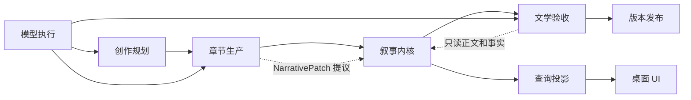

# 自动化小说 V2：叙事内核领域模型

## 1. 文档目的

本文定义自动化长篇小说应用的权威领域模型。它回答三个问题：

1. 哪些数据是事实，哪些只是模型建议或 UI 投影；
2. 一章正文在什么条件下可以改变小说世界；
3. 哪些连续性错误必须由程序确定性阻止。

配套文档：

- [章节生命周期状态机](./chapter-lifecycle-state-machine.md)
- [叙事事件数据库模型](./narrative-event-store-schema.md)

## 2. 第一性原则

### 2.1 单一权威来源

小说世界的权威状态只能由已提交的 `NarrativeEvent` 顺序归约产生。正文、角色卡、资源表、时间线、发布报告和 UI 状态都是投影，不得反向成为事实来源。

### 2.2 模型只有提议权

模型可以生成：

- 章节意图候选；
- 正文候选；
- 结构化事件补丁；
- 文学问题与修订建议。

模型不能：

- 直接修改权威状态；
- 跳过硬约束；
- 用综合评分覆盖事实冲突；
- 在无法识别实体时自行合并或新建实体；
- 将 `deferred` 解释为通过。

### 2.3 不可判定即阻塞

无法证明引用、来源、所有权、时间或知识合法时，系统必须返回稳定失败码并暂停当前章节。禁止兼容、猜测或 fallback。

### 2.4 事实提交必须原子化

一次章节提交必须同时写入：

- 不可变正文版本；
- 章节契约版本；
- 结构化叙事事件；
- 精确正文证据；
- 新权威状态修订；
- 章节提交记录。

任一部分失败，整次提交回滚。

## 3. 边界上下文



| 上下文 | 负责 | 不负责 |
|---|---|---|
| 创作规划 | 故事圣经、卷目标、章节意图、读者承诺 | 修改权威世界状态 |
| 章节生产 | 生成候选正文、抽取补丁、执行有界修订 | 宣布章节已提交 |
| 叙事内核 | 实体、事件、规则、状态归约、冲突判定 | 文风评分 |
| 文学验收 | 节奏、情绪、人物声音、重复、钩子 | 覆盖硬冲突 |
| 版本发布 | 构建不可变发布包 | 修改章节正文 |
| 查询投影 | 为 UI 构建角色卡、时间线、章节状态 | 充当权威写模型 |
| 模型执行 | 按固定契约调用模型并记录完整结果 | 自动切换模型或协议 |

## 4. 聚合与实体

### 4.1 NovelStream

一部小说对应一个顺序事件流。

```ts
interface NovelStream {
  workId: string
  headRevision: number
  storyBibleVersionId: string
  lastCommittedChapterOrdinal: number
}
```

不变量：

- `headRevision` 每次提交只增加 1；
- 同一修订只能由一个章节提交产生；
- 正文顺序不能越过未提交章节；
- 修改已提交事实必须创建新事件，不能原地覆盖历史。

### 4.2 StoryBibleVersion

故事圣经是不可变版本，包含类型承诺、世界规则、人物初始状态、能力边界和终局约束。

```ts
interface StoryBibleVersion {
  id: string
  workId: string
  parentVersionId: string | null
  premise: string
  genrePromises: GenrePromise[]
  worldRules: WorldRule[]
  terminalConditions: TerminalCondition[]
  createdFrom: 'author' | 'planning_candidate'
  contentHash: string
}
```

故事圣经变更不会直接修改当前世界。它创建新版本，并通过影响分析决定需要重放的章节范围。

### 4.3 NarrativeEntity

所有会参与连续性判断的对象都必须有唯一 ID。

```ts
type EntityKind =
  | 'actor'
  | 'artifact'
  | 'location'
  | 'organization'
  | 'ability'
  | 'injury'
  | 'secret'
  | 'objective'

interface NarrativeEntity {
  id: string
  workId: string
  kind: EntityKind
  canonicalName: string
  aliases: string[]
  introducedByEventId: string
  retiredByEventId: string | null
}
```

实体别名只用于解析文本。任何别名命中多个实体时返回 `ENTITY_REFERENCE_AMBIGUOUS`。

### 4.4 ActorState

```ts
interface ActorState {
  actorId: string
  alive: boolean
  locationId: string | null
  physicalConditions: ConditionRef[]
  goals: GoalRef[]
  obligations: ObligationRef[]
  relationships: RelationshipRef[]
}
```

人物持有物品和掌握知识不嵌入 `ActorState` 字符串数组，分别由所有权和知识投影维护。

### 4.5 ArtifactState

```ts
interface ArtifactState {
  artifactId: string
  ownerActorId: string | null
  locationId: string | null
  physicalState: 'intact' | 'damaged' | 'destroyed' | 'consumed'
  quantity: number
  provenanceEventId: string
  provenanceSourceEntityId: string
  lastMutationEventId: string
}
```

不变量：

- 单件物品同一修订只能有一个占有位置；
- `ownerActorId` 与独立 `locationId` 不得同时表示互斥位置；
- 被销毁或消耗的实例不能再次使用；
- 转移前持有人必须与当前权威状态一致；
- 来源只能由显式纠错事件修正，不能被后续描述覆盖。

### 4.6 KnowledgeClaim

```ts
interface KnowledgeClaim {
  id: string
  subjectEntityId: string
  predicate: string
  objectRef: EntityRef | ScalarValue
  truthStatus: 'true' | 'false'
}

interface KnowledgeState {
  holderActorId: string
  claimId: string
  belief: 'knows' | 'believes' | 'suspects' | 'disbelieves'
  learnedByEventId: string
}
```

世界事实、人物认知和读者认知必须分离。权威世界事实不能是 `uncertain`；悬念通过人物和读者尚未获知事实来表达。人物行动依赖某项知识时，必须存在对应的 `KnowledgeState`。

### 4.7 ReaderPromise

```ts
interface ReaderPromise {
  id: string
  question: string
  openedByEventId: string
  status: 'open' | 'advanced' | 'resolved' | 'broken'
  dueWindow: { earliestChapter: number; latestChapter: number }
  lastAdvancedByEventId: string
}
```

读者承诺是发布质量的一部分，但不能取代事实约束。

### 4.8 ChapterIntent

章节意图是生成前的不可变契约。

```ts
interface ChapterIntent {
  id: string
  workId: string
  chapterOrdinal: number
  baseStateRevision: number
  storyBibleVersionId: string
  objective: string
  requiredEvents: EventRequirement[]
  forbiddenEvents: EventProhibition[]
  allowedEntityIds: string[]
  requiredKnowledge: KnowledgeRequirement[]
  emotionContract: EmotionContract
  promiseOperations: PromiseOperation[]
  targetWordRange: { min: number; max: number }
  contentHash: string
}
```

候选正文只能针对一个明确的 `ChapterIntent` 和 `baseStateRevision` 生成。权威状态变化后，旧候选自动失效。

### 4.9 ChapterCandidate 与 ChapterVersion

`ChapterCandidate` 是未提交的模型或人工草稿；`ChapterVersion` 是已提交、不可变的正文版本。

```ts
interface ChapterCandidate {
  id: string
  intentId: string
  parentCandidateId: string | null
  source: 'model' | 'author' | 'revision'
  content: string
  contentHash: string
  wordCount: number
}

interface ChapterVersion {
  id: string
  chapterOrdinal: number
  intentId: string
  content: string
  contentHash: string
  committedStateRevision: number
  commitId: string
}
```

### 4.10 NarrativePatch

模型从候选正文中提议结构化补丁。

```ts
interface NarrativePatch {
  candidateId: string
  baseStateRevision: number
  preconditions: NarrativePrecondition[]
  events: ProposedNarrativeEvent[]
  evidence: EvidenceSpan[]
  schemaVersion: number
}
```

补丁不是事实。只有确定性验证通过并完成章节原子提交后，其中的事件才进入权威事件流。

### 4.11 EvidenceSpan

```ts
type EvidenceContentRef =
  | { kind: 'candidate'; candidateId: string }
  | { kind: 'chapter_version'; chapterVersionId: string }

interface EvidenceSpan {
  contentRef: EvidenceContentRef
  startOffset: number
  endOffset: number
  quoteHash: string
  eventLocalId: string
}
```

证据必须满足：

- 偏移位于 `contentRef` 指向的同一份不可变正文；
- 截取文本哈希等于 `quoteHash`；
- 每个状态变化都有对应证据；
- 生成和修订阶段使用候选证据；
- 章节提交时把通过验证的事件证据转换为章节版本证据；
- 发布审计只接受章节版本证据；
- 正文发生任何变化后旧证据不能用于新版本。

## 5. 叙事事件

首版只允许有限事件集合，不接受任意字符串事件：

| 事件 | 关键前置条件 | 主要结果 |
|---|---|---|
| `ActorMoved` | 人物存活且移动路径合法 | 更新位置 |
| `ActorInjured` | 伤害来源和人物存在 | 添加伤势 |
| `ActorDied` | 人物存活 | 标记死亡并终止主动行为 |
| `ArtifactIntroduced` | 实例 ID 未存在、来源明确 | 创建物品实例 |
| `ArtifactTransferred` | 转出方当前持有 | 变更所有权 |
| `ArtifactConsumed` | 当前可用且数量足够 | 扣减或终止实例 |
| `ArtifactStateChanged` | 状态转换合法 | 更新物理状态 |
| `ClaimEstablished` | 引用实体存在 | 创建世界事实 |
| `ActorLearnedClaim` | 信息传播路径存在 | 更新人物认知 |
| `ReaderInformedClaim` | 正文有明确证据 | 更新读者认知 |
| `PromiseOpened` | 问题尚未存在 | 创建读者承诺 |
| `PromiseAdvanced` | 承诺处于开放状态 | 更新推进位置 |
| `PromiseResolved` | 正文完成兑现 | 关闭承诺 |
| `RelationshipChanged` | 双方人物存在 | 更新关系状态 |

新增事件类型必须同时提供：类型定义、Schema、Reducer、前置条件、反例测试和投影处理器。

## 6. 硬约束与稳定失败码

| 失败码 | 条件 | 是否允许自动修订 |
|---|---|---|
| `ENTITY_REFERENCE_AMBIGUOUS` | 文本引用对应多个实体 | 否，需重新明确引用 |
| `ENTITY_REFERENCE_UNKNOWN` | 关键引用不存在 | 否，需明确新建或改写 |
| `ARTIFACT_PROVENANCE_CONFLICT` | 同一实例出现不兼容来源 | 否 |
| `ARTIFACT_NOT_OWNED` | 使用或转移者不是当前持有人 | 是 |
| `ARTIFACT_ALREADY_RETIRED` | 已销毁或消耗后再次使用 | 是 |
| `ACTOR_NOT_ALIVE` | 死亡人物执行主动事件 | 是 |
| `ACTOR_LOCATION_CONFLICT` | 人物同时出现在互斥地点 | 是 |
| `KNOWLEDGE_PRECONDITION_FAILED` | 人物使用尚未掌握的信息 | 是 |
| `TIMELINE_ORDER_CONFLICT` | 事件顺序或耗时不可能 | 是 |
| `STATE_REVISION_STALE` | 候选基于旧权威状态 | 否，重新规划和生成 |
| `EVIDENCE_SCOPE_MISMATCH` | 证据不属于当前候选正文 | 否 |
| `REQUIRED_EVENT_MISSING` | 章节契约要求未兑现 | 是 |
| `FORBIDDEN_EVENT_PRESENT` | 发生禁止事件 | 是 |

“允许自动修订”仅表示可对同一候选契约进行有界修订，不表示可以跳过错误。

## 7. 命令与写入边界

叙事内核只暴露以下写命令：

```ts
type NarrativeCommand =
  | CreateStoryBibleVersion
  | CreateChapterIntent
  | RegisterChapterCandidate
  | ValidateNarrativePatch
  | CommitChapter
  | SupersedeCommittedChapter
  | RebuildProjection
  | BuildReleasePackage
```

Renderer、IPC 和模型适配器不得直接调用 DAO 修改权威表。所有写入必须经过应用服务、事务和领域校验。

## 8. 发布不变量

章节提交不等于可发布。构建发布包必须满足：

```text
hard_blockers = 0
deferred_gates = 0
stale_findings = 0
unresolved_entity_refs = 0
pending_replay_jobs = 0
all_evidence_bound_to_exact_versions = true
```

文学评分只参与质量排序；任何硬约束失败都直接阻止发布。

## 9. 首批领域测试

1. 物品送出后原持有人再次使用，返回 `ARTIFACT_NOT_OWNED`。
2. 同一物品同时声明“父亲遗物”和“尸体所得”，返回 `ARTIFACT_PROVENANCE_CONFLICT`。
3. 两个同名物品未给出实例引用，返回 `ENTITY_REFERENCE_AMBIGUOUS`。
4. 人物在得知秘密前据此行动，返回 `KNOWLEDGE_PRECONDITION_FAILED`。
5. 已死亡人物执行主动事件，返回 `ACTOR_NOT_ALIVE`。
6. 候选生成后权威修订变化，返回 `STATE_REVISION_STALE`。
7. 引文来自其他章节，返回 `EVIDENCE_SCOPE_MISMATCH`。
8. 同一事件流重放两次，得到完全相同的状态哈希。

## 10. 完成定义

领域内核完成必须同时满足：

- 权威事实不再存储为自由文本数组；
- 所有状态变化都可追溯到事件和正文证据；
- 所有写入口统一经过命令处理器；
- 重放结果稳定；
- 任一不可判定事实都会阻塞提交；
- UI 删除后可完全从事件流重建查询投影。
